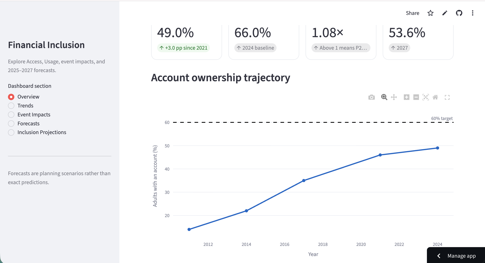
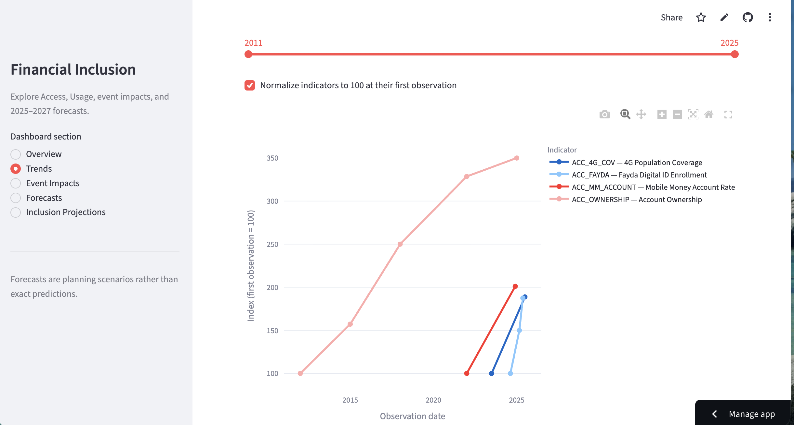
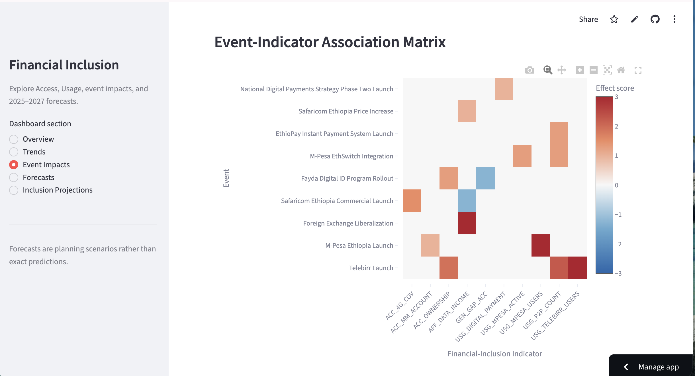
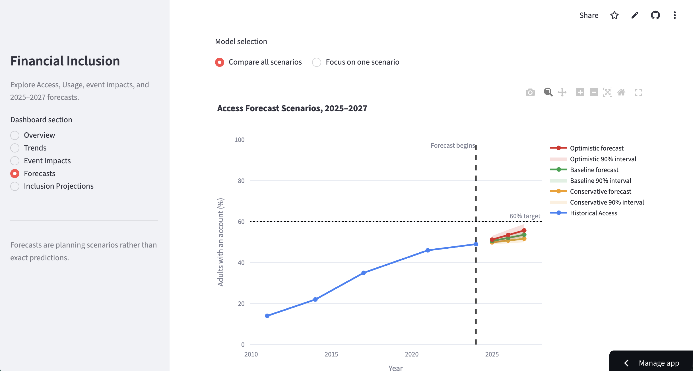
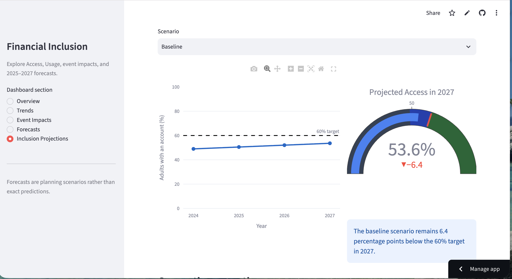

# Forecasting Financial Inclusion in Ethiopia

## Executive Summary

Summarize the business problem, major findings, event-impact results,
2025–2027 forecasts, and policy implications.

## 1. Business Context

Explain Ethiopia's digital-financial transformation and the consortium's
questions about Access and Usage.

## 2. Data and Enrichment

Describe the starter data, unified schema, added observations, events,
impact links, source documentation, and confidence levels.

## 3. Exploratory Data Analysis

Present the main insights:

1. Account ownership increased from 14% in 2011 to 49% in 2024.
2. Growth slowed to only 3 percentage points from 2021 to 2024.
3. Registered mobile-money accounts greatly exceed survey-measured ownership.
4. P2P transactions surpassed ATM transactions.
5. The gender gap narrowed but remains substantial.
6. Historical coverage is sparse and uneven.

Include the strongest supporting figures.

## 4. Event-Impact Modeling

Explain:

- How events were joined to impact links
- How qualitative magnitude and direction became standardized scores
- How lagged effects were represented
- How overlapping effects were combined
- Validation against available historical evidence
- Why associations are not interpreted as causal estimates

Include the event-indicator matrix and strongest-effect chart.

## 5. Access and Usage Forecasts

Explain the conservative, baseline, and optimistic scenarios.

### Access forecast for 2027

- Conservative: 51.6%
- Baseline: 53.6%
- Optimistic: 55.7%

### Usage forecast for 2027

- Conservative: 67.5%
- Baseline: 71.3%
- Optimistic: 75.0%

Discuss the 90% uncertainty intervals and the assumptions behind them.

## 6. Interactive Dashboard

Describe the five dashboard sections and provide the deployed dashboard link.

## 7. Main Limitations

Discuss:

- Five national Access observations
- One comparable Usage percentage baseline
- Differences between administrative registrations and survey measures
- Overlapping events
- Lack of causal identification
- Uncertainty in event magnitudes and lags
- Unobserved economic and regulatory shocks

## 8. Future Work

Recommend:

- Adding more disaggregated and high-frequency data
- Measuring active rather than registered accounts
- Regional and gender-specific forecasting
- Updating forecasts when new Findex observations become available
- Formal causal evaluation of major policy and product interventions
- Automated data refresh and model monitoring

## Conclusion

Summarize what the project contributes and how stakeholders should interpret
the forecasts.

## Repository and Dashboard

- GitHub repository: add the final repository link
- Live dashboard: add the deployed Streamlit link