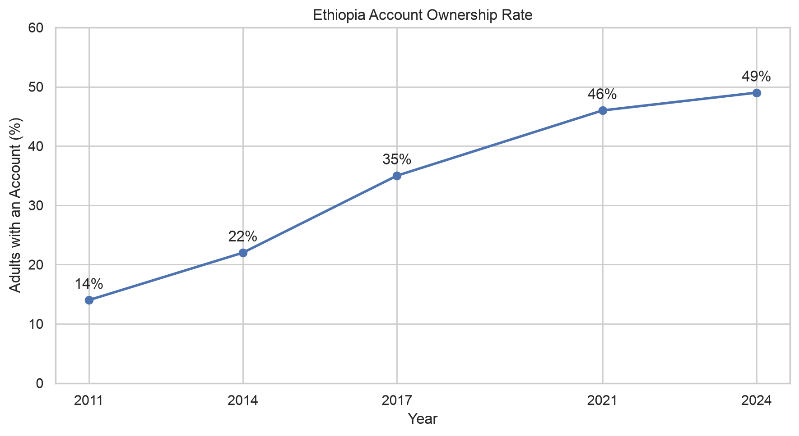
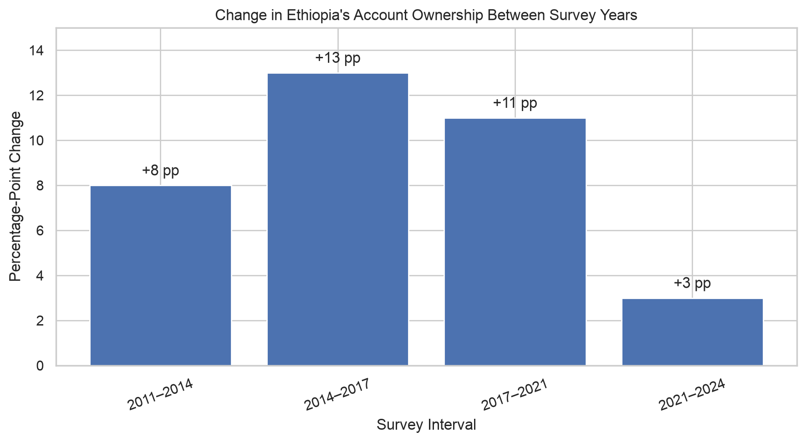
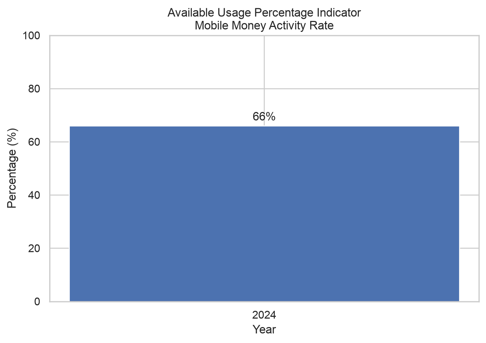
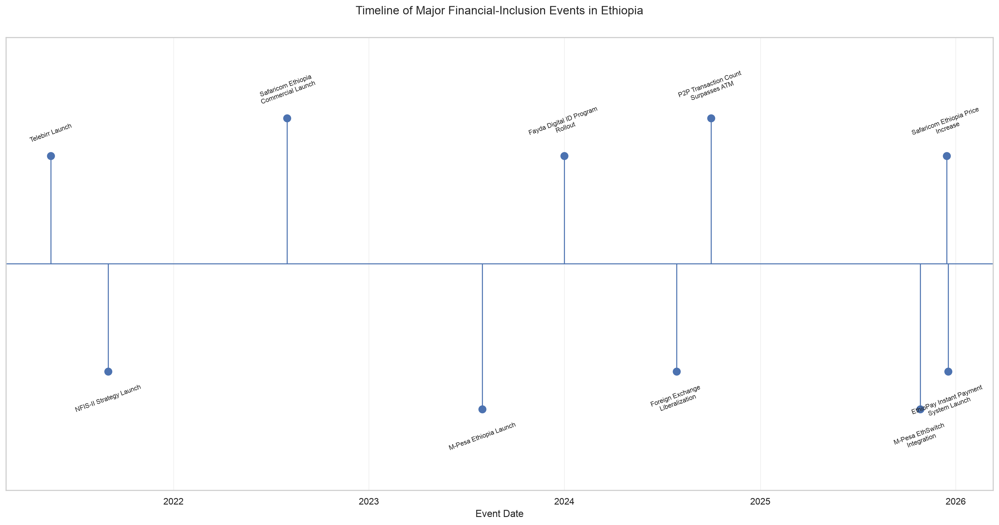

# Interim Report: Forecasting Financial Inclusion in Ethiopia

## 1. Executive Summary

This interim project analyzes Ethiopia's financial-inclusion development,
with particular attention to Access and Usage. The work completed so far
includes data exploration, data-quality assessment, professional data
enrichment, exploratory data analysis, event mapping, and the
identification of preliminary forecasting considerations.

The supplied workbook contained 43 primary records and 14 impact-link
records. Five carefully documented enrichment records were added,
producing a final analysis dataset containing 62 records and 35 columns.

The analysis indicates that account ownership increased substantially
between 2011 and 2021 but grew more slowly between 2021 and 2024. The
available Usage data also demonstrates that registered users, active
users, merchants, agents, and transaction values measure different parts
of financial inclusion and should not be interpreted as interchangeable.

## 2. Dataset and Enrichment

The unified dataset contains four main record types:

- 33 observations
- 15 impact links
- 11 events
- 3 policy targets

The enrichment process added five records:

1. Telebirr agent-network size
2. Telebirr merchant-network size
3. Telebirr digital-savings customers
4. National Digital Payments Strategy Phase Two launch
5. A preliminary impact link between the strategy and digital-payment usage

The final enriched dataset is stored at:

`data/processed/ethiopia_fi_enriched.csv`

All enrichment sources, transformations, assumptions, and confidence
levels are documented in `data_enrichment_log.md`.

## 3. Account Ownership Analysis

The national Global Findex account-ownership series used in the analysis
is:

| Year | Account ownership |
|---:|---:|
| 2011 | 14% |
| 2014 | 22% |
| 2017 | 35% |
| 2021 | 46% |
| 2024 | 49% |

Account ownership increased by:

- 8 percentage points between 2011 and 2014
- 13 percentage points between 2014 and 2017
- 11 percentage points between 2017 and 2021
- 3 percentage points between 2021 and 2024

The most recent interval therefore shows a substantial slowdown compared
with the earlier survey periods.

## 4. Usage Analysis

The Usage records include percentages, registered users, active users,
transaction counts, transaction values, and network indicators. These
measure different concepts and cannot be placed on one common scale.

Only one valid percentage-based Usage observation was available: the
Mobile Money Activity Rate was 66% in 2024. This is a useful snapshot,
but it is not enough to establish a historical percentage-based Usage
trend.

M-Pesa reported 10.8 million registered users and 7.1 million users active
within 90 days. This difference demonstrates that registrations should
not be interpreted as equivalent to recent active usage.

Telebirr's agent network, merchant network, and digital-savings customers
provide evidence about service availability and deeper financial-service
usage. They should not, however, be treated as counts of unique active
adults.

## 5. Event Analysis

The dataset includes important events such as telecommunications and
mobile-money launches, market entry, infrastructure development, policy
changes, digital-identity developments, interoperability initiatives,
and the National Digital Payments Strategy.

The event timeline provides useful historical context, but visual timing
alone does not establish causal impact. Event effects should be represented
as hypotheses with documented directions, magnitudes, lags, evidence
bases, and confidence levels.

## 6. Key Findings

### Finding 1: Account ownership growth slowed after 2021

Account ownership increased from 14% in 2011 to 46% in 2021 but reached
only 49% in 2024. The three-percentage-point increase in the latest
interval is smaller than all previous changes.

### Finding 2: Registered accounts do not equal active users

Administrative registration figures can contain inactive accounts,
duplicate users, business accounts, and users who already hold formal
bank accounts. Active-user and survey-based measures provide a different
view of actual financial inclusion.

### Finding 3: Usage may change faster than Access

New payment services, merchant networks, interoperability, and digital
savings may increase the frequency and variety of financial-service use
without creating an equivalent number of new account owners.

### Finding 4: Infrastructure is necessary but not sufficient

Agent networks, merchant acceptance, telecommunications coverage,
interoperability, and digital identity support financial inclusion.
However, affordability, trust, literacy, gender gaps, rural access, and
product relevance remain important constraints.

### Finding 5: Forecasting uncertainty is high

The national account-ownership series contains only five survey
observations. Many other indicators contain one or two observations and
use different units and frequencies. Forecasts should therefore use
simple, transparent methods with wide uncertainty ranges and explicit
scenario assumptions.

## 7. Correlation Limitation

A multi-indicator correlation heatmap was not generated. Only the national
account-ownership indicator had enough repeated observations, while the
other indicators lacked sufficient overlapping annual values.

Creating a correlation heatmap from such sparse data would be misleading.
The displayed self-correlation of 1.0 is not evidence of a relationship
between different variables.

## 8. Data Limitations

The main limitations are:

- Global Findex observations are available only in selected survey years.
- Administrative and survey indicators use different definitions.
- Registered accounts may include inactive or duplicate users.
- Indicators use percentages, people, transactions, currency values, and ratios.
- Several indicators contain only one or two historical observations.
- Comparable regional, gender, urban-rural, affordability, and active-usage data remain limited.
- Event timing does not prove causation.
- Impact magnitude and lag assumptions require future validation.

## 9. Interim Conclusion

The interim analysis establishes a reproducible data foundation for
forecasting Ethiopia's financial inclusion. It identifies meaningful
growth in account ownership, a recent slowdown in Access growth,
significant differences between registration and active usage, and major
data limitations.

The next phase should prioritize transparent forecasting methods,
scenario analysis, uncertainty intervals, and additional comparable
observations for percentage-based Usage indicators.